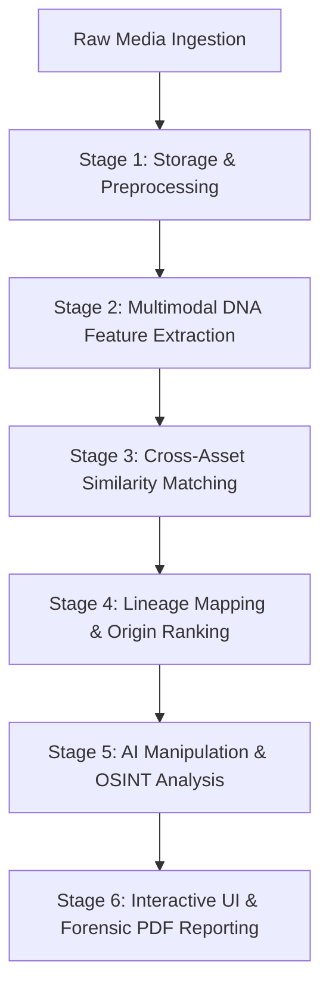

# TraceLens AI

> **Media DNA & Cross-Platform Forensic Intelligence Engine**

TraceLens AI is an enterprise-grade, production-ready full-stack media intelligence platform designed for cybersecurity researchers, OSINT analysts, fact-checkers, and digital forensic investigators. It enables the extraction of unique "Media DNA Profiles" combining cryptographic hashes (MD5, SHA256), three independent perceptual hashes (pHash, dHash, aHash), custom audio spectrogram fingerprints, metadata structures, and deep AI semantic vision embeddings (OpenAI CLIP). The similarity matching and lineage mapping engines track variants across compression, resizing, watermarking, cropping, rotation, and re-encoding.

---

## 🏗️ System Architecture & End-to-End Pipeline

TraceLens AI follows a modular micro-service architecture separating asynchronous backend media processing engines from a modern, reactive frontend visualization interface.

### **High-Level System Architecture**

```
 ┌─────────────────────────────────────────────────────────────────────────┐
 │                       FRONTEND CLIENT (Next.js 16)                      │
 │   Dashboard  │  Upload Pipeline  │  DNA Compare  │ Lineage DAG  │ Sandbox   │
 └────────────────────────────────────┬────────────────────────────────────┘
                                      │ REST API / JSON
 ┌────────────────────────────────────▼────────────────────────────────────┐
 │                        BACKEND SERVER (FastAPI)                         │
 │  ┌───────────────────────────────────────────────────────────────────┐  │
 │  │ API Routers & CORS Middleware (`main.py`)                          │  │
 │  └──────────────────────────────────┬────────────────────────────────┘  │
 │                                     │                                   │
 │  ┌──────────────────────────────────▼────────────────────────────────┐  │
 │  │ Media Ingestion & Demuxing (`video_analyzer.py`)                   │  │
 │  │ ├── OpenCV (Keyframe Extraction)                                  │  │
 │  │ └── FFmpeg (Audio Stream Demuxing)                                │  │
 │  └──────────────────────────────────┬────────────────────────────────┘  │
 │                                     │                                   │
 │  ┌──────────────────────────────────▼────────────────────────────────┐  │
 │  │ Media DNA Extraction Engine (`dna_engine.py`)                     │  │
 │  │ ├── Cryptographic Hashes (MD5, SHA-256)                            │  │
 │  │ ├── Multi-Algorithmic pHashes (pHash, dHash, aHash)               │  │
 │  │ ├── Spectrogram Audio Fingerprinting (Librosa + SciPy)            │  │
 │  │ └── AI Semantic Embeddings (HuggingFace CLIP ViT-B/32)             │  │
 │  └──────────────────────────────────┬────────────────────────────────┘  │
 │                                     │                                   │
 │  ┌──────────────────────────────────▼────────────────────────────────┐  │
 │  │ Intelligence & Analytics Engines                                  │  │
 │  │ ├── Similarity & Lineage Engine (`similarity_engine.py`)           │  │
 │  │ ├── AI Editing Artifact Analyzer (`ai_editing_engine.py`)         │  │
 │  │ ├── OSINT & Web Intelligence (`osint_intelligence.py`)            │  │
 │  │ └── Automated Evaluation Benchmarking (`evaluation_manager.py`)   │  │
 │  └──────────────────────────────────┬────────────────────────────────┘  │
 │                                     │                                   │
 │  ┌──────────────────────────────────▼────────────────────────────────┐  │
 │  │ Persistence & Output Layer                                        │  │
 │  │ ├── SQLite Database via SQLAlchemy ORM (`models.py`)              │  │
 │  │ └── Forensic PDF Report Generator (`report_generator.py`)         │  │
 │  └───────────────────────────────────────────────────────────────────┘  │
 └─────────────────────────────────────────────────────────────────────────┘
```

---

### 🔄 End-to-End Media Processing Pipeline

The ingestion and analysis pipeline transforms raw media files into searchable forensic intelligence across 6 sequential stages:



#### **Stage 1: Storage & Preprocessing (`video_analyzer.py`)**
1. **File Ingestion**: Uploaded media streams are saved to `app/uploads/` with UUID file naming.
2. **Stream Demuxing**: Video assets trigger OpenCV to sample representative keyframes saved to `app/keyframes/`.
3. **Audio Extraction**: FFmpeg demuxes audio tracks into downsampled 11kHz WAV streams for memory-efficient processing.

#### **Stage 2: Multimodal DNA Feature Extraction (`dna_engine.py`, `phash_visualizer.py`)**
1. **Cryptographic Signatures**: Computes MD5 and SHA-256 binary digests for exact integrity checking.
2. **Perceptual Visual Hashing**: Calculates 64-bit binary matrices for `pHash` (Discrete Cosine Transform), `dHash` (gradient difference), and `aHash` (average luminance).
3. **6-Stage pHash Breakdown**: Computes intermediate visual matrices (Original -> Grayscale -> 32x32 Downsampling -> DCT Matrix Heatmap -> 8x8 Low Frequency Selection -> 64-bit pHash Binary Grid).
4. **Audio Spectrogram Profiling**: Librosa extracts chroma energy features and SciPy calculates spectral peak distributions to generate unique audio signatures.
5. **AI Semantic Vector Embedding**: HuggingFace Transformers passes keyframes through OpenAI CLIP (ViT-B/32) to compute 512-dimensional dense vector embeddings.

#### **Stage 3: Cross-Asset Similarity Matching (`similarity_engine.py`)**
1. **Hamming Distance Matrix**: Evaluates bitwise differences between target pHash/dHash/aHash grids and indexed database assets.
2. **Cosine Embedding Similarity**: Computes directional dot products between 512D CLIP semantic vectors.
3. **Audio Spectral Correlation**: Cross-correlates audio chroma matrices across indexed audio signatures.
4. **Weighted Confidence Score**: Synthesizes visual, semantic, and audio similarity scores into an overall confidence percentage (0-100%).

#### **Stage 4: Lineage Mapping & Origin Ranking (`similarity_engine.py`)**
1. **Variant Grouping**: Identifies candidate matches exceeding similarity thresholds.
2. **Generation Depth Calculation**: Analyzes image resolution, compression noise, and metadata creation dates.
3. **DAG Tree Synthesis**: Builds a Directed Acyclic Graph (DAG) establishing parent-child propagation paths radiating from the predicted root source origin.

#### **Stage 5: AI Manipulation & OSINT Intelligence (`ai_editing_engine.py`, `osint_intelligence.py`)**
1. **Splicing & Editing Detection**: Analyzes spatial noise patterns and boundary anomalies to detect digital modifications.
2. **Web Footprint Scraper**: Simulates reverse image checks and cross-platform monitoring (`web_intelligence.py`) to trace media dissemination across public platforms.

#### **Stage 6: Interactive UI & Forensic PDF Reporting (`report_generator.py`)**
1. **Real-time Frontend Display**: Renders interactive SVG lineage trees, side-by-side Hamming grid comparators, and pipeline progress streams in Next.js.
2. **Forensic PDF Export**: ReportLab compiles an audit-ready dark-themed PDF document complete with chain-of-custody hashes, metadata breakdowns, and integrity risk scores.

---

## 🛠️ Complete List of Libraries & Frameworks Used

### **Frontend Frameworks & Libraries**
- **[Next.js 16.2](https://nextjs.org/)**: React Framework for production with App Router architecture.
- **[React 19.2](https://react.dev/) & [React DOM 19.2](https://react.dev/)**: Core user interface library and DOM renderer.
- **[TypeScript 5](https://www.typescriptlang.org/)**: Strongly typed programming language.
- **[Tailwind CSS v4](https://tailwindcss.com/) (`@tailwindcss/postcss`)**: Utility-first CSS framework for design system styling.
- **[Lucide React](https://lucide.react.dev/) (`lucide-react`)**: Modern vector icon library for cybersecurity icons.
- **[Framer Motion](https://www.framer.com/motion/) (`framer-motion`)**: Production-ready motion and UI animation library.
- **[Recharts](https://recharts.org/) (`recharts`)**: Charting library built with React for data visualizations.
- **[ESLint 9](https://eslint.org/) (`eslint-config-next`)**: JavaScript and Next.js static code analysis tool.

### **Backend Frameworks & Libraries**
- **[FastAPI](https://fastapi.tiangolo.com/)**: Modern, high-performance web framework for building APIs with Python 3.12+.
- **[Uvicorn](https://www.uvicorn.org/) (`uvicorn[standard]`)**: ASGI web server implementation for Python APIs.
- **[SQLAlchemy](https://www.sqlalchemy.org/)**: Python SQL toolkit and Object Relational Mapper (ORM) powering SQLite (`tracelens.db`).
- **[Pydantic](https://docs.pydantic.dev/) & `pydantic-settings`**: Data validation schemas and settings management.
- **[PyTorch](https://pytorch.org/) (`torch`)**: Machine learning and deep learning tensor processing framework (CPU-optimized).
- **[Hugging Face Transformers](https://huggingface.co/docs/transformers/) (`transformers`)**: Machine learning models library running OpenAI CLIP vision embeddings.
- **[OpenCV](https://opencv.org/) (`opencv-python-headless`)**: Computer vision library for keyframe extraction and spatial analysis.
- **[Pillow](https://python-pillow.org/) (`Pillow`)**: Python Imaging Library for image loading and modifications.
- **[ImageHash](https://pypi.org/project/ImageHash/) (`imagehash`)**: Multi-algorithm perceptual image hashing (pHash, dHash, aHash).
- **[Librosa](https://librosa.org/) (`librosa`)**: Audio signal processing library for spectral chroma profiling.
- **[SciPy](https://scipy.org/) (`scipy`)**: Scientific computing library for matrix peak processing and mathematical calculations.
- **[ReportLab](https://www.reportlab.com/) (`reportlab`)**: Document creation engine for generating forensic PDF reports.
- **[Python-Multipart](https://github.com/Kludex/python-multipart) (`python-multipart`)**: Streaming multipart parser for file uploads.
- **[HTTPX](https://www.python-httpx.org/) (`httpx`)**: Asynchronous HTTP client library for external OSINT intelligence checks.
- **[Jinja2](https://jinja.palletsprojects.com/) (`jinja2`)**: Templating engine for structured report templates.
- **[Python-Dotenv](https://github.com/theskumar/python-dotenv) (`python-dotenv`)**: Environment variable loader from `.env` files.
- **[FFmpeg](https://ffmpeg.org/)**: Multimedia CLI framework for video demuxing and audio extraction.

---

## ⚡ Key Functionality & Core Modules

1. 📊 **Executive Dashboard Console**: High-level overview displaying indexed assets, active cases, cross-platform matches, and risk scores.
2. 📁 **Forensic Case Management**: Workspace partitioning organizing evidence into isolated cases (e.g., *Case #2026-ALPHA*).
3. 🚀 **Real-Time Ingestion Visualizer**: Multi-stage progress board sequencing file upload, hashing, audio parsing, and matching.
4. 🔬 **Interactive 6-Stage pHash Visualizer**: Educational stepper displaying pHash generation from original image to 64-bit binary grid.
5. 🧬 **DNA Side-by-Side Comparator**: Granular binary comparison displaying Hamming matrix differentials and similarity confidence.
6. 🎛️ **Fingerprint Sandbox Playground**: Interactive slider engine testing pHash resilience against crop, watermark, scale, and compression.
7. 🌳 **Lineage SVG Propagation Graphs**: Dynamic DAG visualizing propagation trees and identifying root source origin.
8. 🤖 **AI Editing & Modification Detection**: Automated detector identifying digital splicing and spatial edits.
9. 🌐 **OSINT & Web Intelligence Engine**: Scrapers tracking external media footprints and reverse image matches.
10. 📈 **Evaluation & Benchmarking Framework**: Automated testbed calculating Precision, Recall, F1-Score, and ROC curves.
11. 📄 **Automated Forensic PDF Reports**: Dark-themed, printable PDF audit reports containing chain-of-custody data and lineage graphs.

---

## 📂 Project Directory Structure

```
TraceLens AI/
├── backend/
│   ├── app/
│   │   ├── uploads/            # Ingested raw media assets
│   │   ├── keyframes/          # Extracted video keyframe thumbnails
│   │   ├── reports/            # Generated forensic PDF documents
│   │   ├── database.py         # SQLAlchemy SQLite session config & engine
│   │   ├── models.py           # SQLAlchemy ORM models (Case, MediaItem, Relationship)
│   │   ├── schemas.py          # Pydantic validation schemas
│   │   ├── dna_engine.py       # Comprehensive DNA calculation & integrity scoring
│   │   ├── phash_visualizer.py # 6-stage pHash step calculation & base64 encoder
│   │   ├── video_analyzer.py   # OpenCV keyframing & FFmpeg audio extraction
│   │   ├── similarity_engine.py# Cross-matching algorithm, Hamming distance & graph generator
│   │   ├── ai_editing_engine.py# AI manipulation & editing artifact analysis
│   │   ├── osint_intelligence.py# OSINT reverse image search & monitoring
│   │   ├── web_intelligence.py # Web scraping & external intelligence gathering
│   │   ├── evaluation_manager.py# Benchmarking, ROC curve & metric calculations
│   │   ├── report_generator.py # ReportLab PDF design builder
│   │   ├── variant_generator.py# Synthetic variant generator (crop, watermark, etc.)
│   │   ├── seeder.py           # Database auto-seeder (mock media & cases)
│   │   ├── migrate.py          # Schema migration script
│   │   └── main.py             # FastAPI entrypoint, routes, & CORS middleware
│   ├── requirements.txt        # Python dependency manifests
│   └── .env                    # Application environment configuration flags
├── frontend/
│   ├── src/app/
│   │   ├── compare/            # Side-by-side DNA grid differentials view
│   │   ├── demo/               # Live interactive demonstration view
│   │   ├── evaluation/         # Performance benchmarking & ROC metrics dashboard
│   │   ├── media/[id]/         # Media Details, Keyframe analysis & Lineage graphs
│   │   ├── playground/         # Fingerprint transformation sandbox sliders
│   │   ├── upload/             # Real-time ingestion pipeline visualizer
│   │   ├── globals.css         # Custom CSS tokens, cyber glow styles & animations
│   │   └── layout.tsx / page.tsx# Main layout, navigation header & executive dashboard
│   ├── package.json            # React 19 & Next.js 16 dependencies
│   └── tsconfig.json           # TypeScript build targets
└── README.md                   # Complete documentation
```

---

## 🚀 Local Setup & Installation

### Prerequisite System Packages
- **Python**: Version `3.10` or higher (tested on `3.12.0`).
- **Node.js**: Version `18.0` or higher (tested on `24.14.1`).
- **FFmpeg**: Required on system PATH for video framerate keyframing and audio extraction. Ensure `ffmpeg` is accessible in your environment.

---

### Step 1: Start the Backend Server

1. Open a terminal and navigate to the backend folder:
   ```bash
   cd backend
   ```
2. Install Python dependencies:
   ```bash
   pip install -r requirements.txt
   ```
3. Start the FastAPI development server using Uvicorn:
   ```bash
   python -m uvicorn app.main:app --reload --port 8000
   ```

---

### Step 2: Start the Frontend Application

1. Open a separate terminal and navigate to the frontend folder:
   ```bash
   cd frontend
   ```
2. Install Node dependencies (if not already installed):
   ```bash
   npm install
   ```
3. Run the Next.js development server:
   ```bash
   npm run dev
   ```
4. Access the application in your browser at `http://localhost:3000`.
