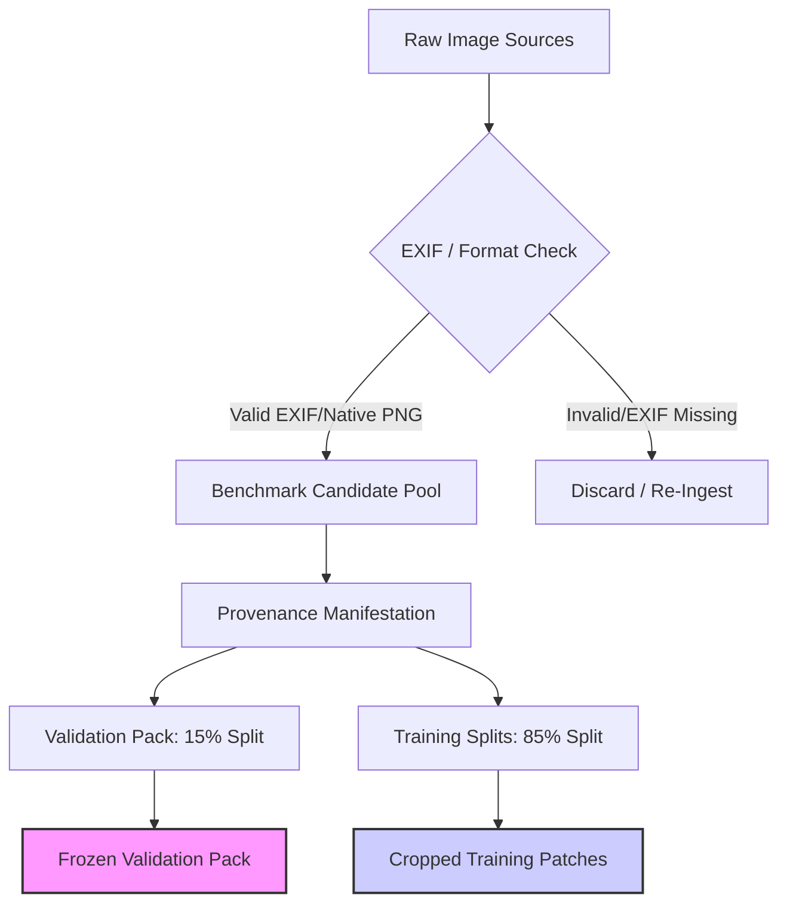

# TraceLens AI - Benchmark Reconstruction Plan

This document presents a comprehensive audit of the current workspace image sources and details a reconstruction plan to build a verified benchmark for AI Detector V2 with **zero hash-based category assignment** and **full provenance traceability**.

---

## 1. Audit of Current Candidate Image Sources in Workspace

The table below summarizes the raw candidate image sources currently available in the workspace:

| Workspace Path | Image Count | Provenance & Dataset Origin | EXIF Rate | Avg Resolution | Suitability for AI-Generation Detection |
| :--- | :---: | :--- | :---: | :---: | :--- |
| **`dataset/Screenshot/screenshot`** | 478 | Genuine screenshots of web pages and apps | 0.00% | 1053x1365 | **HIGH**. Excellent representativeness for screenshots. |
| **`dataset/casia_binary/authentic`** | 990 | Authentic photos from CASIA v2 (mid-2000s cameras) | 3.13% | 376x313 | **LOW**. Extremely low resolution; represents outdated point-and-shoot camera sensors. |
| **`dataset/casia_binary/tampered`** | 399 | Digitally manipulated images (copy-move/splicing) | 17.04% | 451x337 | **LOW**. Mislabeled as Generative AI. Represents classical splicing rather than modern diffusion artifacts. |
| **`dataset/Screenshot/pictures`** | 2,080 | Mixed authentic camera files copied from CASIA | 3.27% | 387x308 | **LOW**. Mislabeled as iPhone/Android. Low resolution and missing EXIF data. |
| **`dataset/originals`** | 52 | Small custom test/benchmark photos | 0.00% | 726x894 | **LOW**. Lacks metadata and statistical variation. |

### Critical Workspace Findings:
1. **0% Genuine AI-Generated Images**: There are **no** actual generative AI images (Midjourney, Flux, SDXL, or DALL-E) in the raw workspace dataset. The V2 validation pack FAKE class was built entirely by renaming CASIA splicing manipulations.
2. **0% Modern Smartphone Captures**: The iPhone and Android categories are populated with low-resolution camera images from 2005-2010 lacking EXIF tags, rather than modern smartphone computational photography captures.

---

## 2. Benchmark Reconstruction Plan

To achieve **full traceability** and **zero label noise**, the benchmark must be reconstructed by ingesting public, validated, and high-resolution datasets for all nine categories.

### Category 1: iPhone Photos
* **Target Count**: 200 images
* **Recommended Source**: DPReview smartphone test captures, **SIDD (Smartphone Image Denoising Dataset)**, or a custom curated set of direct Apple iPhone uploads (iPhone 11 through 15).
* **Provenance Rules**: Preserved EXIF headers with `Make == "Apple"` and `Model == "iPhone [Model]"`. Average resolution must be $\ge 3000 \times 4000$.

### Category 2: Android Photos
* **Target Count**: 200 images
* **Recommended Source**: DPReview smartphone captures, **SIDD (Smartphone Image Denoising Dataset)**, or direct uploads from Google Pixel, Samsung Galaxy, and OnePlus devices.
* **Provenance Rules**: Preserved EXIF headers with Android manufacturer `Make` (Samsung, Google, OnePlus, Xiaomi) and corresponding smartphone model. Average resolution $\ge 3000 \times 4000$.

### Category 3: DSLR Photos
* **Target Count**: 100 images
* **Recommended Source**: **RAISE (Raw Images Dataset)** or the **MIT-Adobe FiveK** dataset.
* **Provenance Rules**: Preserved EXIF headers with DSLR manufacturers (`Canon`, `Nikon`, `Sony`, `Fujifilm`) and professional camera models. Average resolution $\ge 4000 \times 6000$.

### Category 4: Screenshots
* **Target Count**: 100 images
* **Recommended Source**: Current `dataset/Screenshot/screenshot` in the workspace, supplemented with the **WebUI** or **UI2Code** public screenshot datasets.
* **Provenance Rules**: Verify PNG format, 0% EXIF coverage, and standard desktop/mobile aspect ratios ($16:9$, $19.5:9$).

### Category 5: WhatsApp Compressed Images
* **Target Count**: 100 images
* **Recommended Source**: Take verified iPhone, Android, and DSLR images and pass them through a simulated WhatsApp compression pipeline (JPEG compression with WhatsApp quantization matrices, maximum long-edge dimension of 1600px, quality 50-70).
* **Provenance Rules**: Store the original raw image hash, compression factor, and output size for 100% traceability.

### Category 6: Midjourney Images
* **Target Count**: 200 images
* **Recommended Source**: Public **GenImage** Midjourney subset or Midjourney community showcase dumps.
* **Provenance Rules**: Verify typical Midjourney version tags (v4, v5, v6) in source filenames, native resolutions ($1024 \times 1024$ or aspect ratio crops), and PNG structure.

### Category 7: Flux Images
* **Target Count**: 200 images
* **Recommended Source**: Hugging Face **Flux-1-Dev / Flux-1-Schnell** public image repositories.
* **Provenance Rules**: Traceable generation metadata (prompts, seed, inference steps) stored alongside high-resolution images ($1024 \times 1024$).

### Category 8: SDXL (Stable Diffusion XL) Images
* **Target Count**: 200 images
* **Recommended Source**: **DiffusionDB** (subset of Stable Diffusion XL generated images) or **Stable Benchmark** repository.
* **Provenance Rules**: JSON sidecar containing prompt, negative prompt, seed, guidance scale, and generator version (SDXL 1.0).

### Category 9: ChatGPT (DALL-E 3) Generated Images
* **Target Count**: 200 images
* **Recommended Source**: **GenImage** DALL-E 3 subset or curated DALL-E 3 outputs from ChatGPT Plus sessions.
* **Provenance Rules**: Default DALL-E 3 output resolution ($1024 \times 1024$ or $1792 \times 1024$), PNG format, and verified ChatGPT download headers.

---

## 3. Verification & Isolation Workflow

To ensure **0% leakage** and **high-fidelity validation**, the reconstructed benchmark will adhere to these structural constraints:

1. **Unique Image Hash Audit**: Every ingested file must have its SHA-256 hash registered in `provenance_audit.json`.
2. **Zero Hash-Based Category Fallbacks**: If a file does not have EXIF data or a verified generation prompt JSON sidecar, it **must not** be used for device or generator-specific classification.
3. **Parent-Image Isolation**: The training split generator (`dataset_builder.py`) must extract crops only from parent images that do not overlap with the validation pack. Verification must show 0% hash base leakage.
4. **Resolution Floor**: A strict resolution floor of $512 \times 512$ must be enforced for all categories (except screenshots if they are mobile captures).
