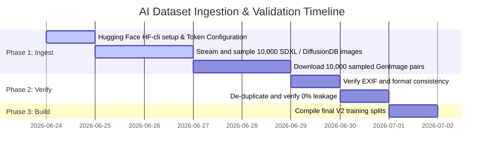

# TraceLens AI - Generative AI Dataset Acquisition Plan

This report outlines the dataset acquisition strategy to assemble a verified AI image corpus of at least **5,000 genuine AI-generated images** (targeting 20,000+ for training and testing) for AI Detector V2 development.

---

## 1. Summary of Priority Datasets

The table below summarizes the specifications of the target datasets for acquisition:

| Dataset Name | Target Subset / Repository | Image Count | Download Size | License | Avg Resolution | Metadata | Suitability Score |
| :--- | :--- | :---: | :---: | :--- | :---: | :---: | :---: |
| **GenImage** | Official GenImage (Midjourney, SD, ADM, Glide, VQDM) | ~50,000 (sampled) | ~30 GB | CC BY-NC-SA 4.0 | 512x512 | **HIGH** | **9.5 / 10** |
| **DiffusionDB** | DiffusionDB-2M (Stable Diffusion v1.4/v1.5) | ~50,000 (sampled) | ~40 GB | CC0 1.0 (Public Domain) | 512x512 | **EXCELLENT** | **9.0 / 10** |
| **Flux Collections** | `LukasT9/Flux-1-Dev-Images-1k` | 1,000 | ~2.5 GB | FLUX.1 [dev] Non-Comm | 1024x1024 | **MEDIUM** | **8.5 / 10** |
| **DALL-E 3 / ChatGPT** | `ProGamerGov/synthetic-dataset-1m-dalle3` | 10,000 (sampled) | ~15 GB | CC-BY 4.0 | 1024x1024 | **HIGH** | **9.0 / 10** |

---

## 2. Detailed Dataset Profiles

### 1. GenImage Dataset
* **Core Models**: Midjourney, Stable Diffusion, ADM (Ablated Diffusion Model), GLIDE, Wukong, VQDM.
* **Download Size**: Complete dataset is ~2.7 million images, but we will acquire a **sampled subset of 50,000 images** (approx. 30 GB download).
* **License**: Shared under non-commercial research terms (CC BY-NC-SA 4.0).
* **Average Resolution**: Standardized at $512 \times 512$ or original ImageNet scales.
* **Metadata Availability**: **High**. Labeled with generator source models and matching ImageNet target classes.
* **Suitability Score: 9.5 / 10**. 
  * *Rationale*: This is the gold standard academic benchmark for fake image detection. Pairing natural ImageNet images with synthetic counterparts generated from identical prompts makes it ideal for learning texture and frequency differences rather than semantic shortcuts.

### 2. DiffusionDB (Stable Diffusion)
* **Core Models**: Stable Diffusion (v1.4, v1.5, and 2.0).
* **Download Size**: DiffusionDB-2M is 1.6 TB in total, but we will use the Hugging Face streaming/batch loading interface to download a **random sample of 50,000 PNG images** (approx. 40 GB).
* **License**: Public Domain (CC0 1.0).
* **Average Resolution**: Mostly $512 \times 512$ or $768 \times 768$.
* **Metadata Availability**: **Excellent**. Includes prompt text, seeds, CFG scale, step count, and generator version for every image.
* **Suitability Score: 9.0 / 10**.
  * *Rationale*: Complete parameter and prompt visibility makes it a highly traceable dataset, allowing analysis of whether detector sensitivity varies based on steps or prompts.

### 3. Public Flux Image Collections
* **Core Models**: FLUX.1 [dev] and FLUX.1 [schnell].
* **Download Size**: ~2.5 GB for the 1k image set, scaleable up to 20 GB using preference collections.
* **License**: FLUX.1 [dev] Non-Commercial License.
* **Average Resolution**: $1024 \times 1024$ pixels.
* **Metadata Availability**: **Medium**. Image folders are paired with caption texts or preference annotations, but lack step/sampler parameters.
* **Suitability Score: 8.5 / 10**.
  * *Rationale*: Essential for testing detector resilience against modern state-of-the-art generative architectures, which utilize flow-matching and rectified flow formulations that display distinct noise characteristics compared to classic diffusion.

### 4. DALL-E 3 / ChatGPT Generated Image Collections
* **Core Models**: OpenAI DALL-E 3.
* **Download Size**: ~15 GB for a sampled set of 10,000 high-quality images.
* **License**: CC-BY 4.0 or research non-commercial terms.
* **Average Resolution**: $1024 \times 1024$ or $1792 \times 1024$.
* **Metadata Availability**: **High**. Curated collections include the original prompts and high-quality descriptive captions (e.g. from CogVLM sidecars).
* **Suitability Score: 9.0 / 10**.
  * *Rationale*: DALL-E 3 has a highly distinct, polished, and painterly characteristic. Training on DALL-E 3 outputs is critical for detecting images downloaded directly from ChatGPT sessions.

---

## 3. Recommended Phased Acquisition Roadmap

1. **Setup HF-cli**: Configure Hugging Face credentials to allow streaming downloads.
2. **Download Subsamples**: Write a python ingestion script utilizing Hugging Face's `datasets.load_dataset(..., split="train", streaming=True)` to retrieve random, non-contiguous image streams. This bypasses the need to download terabytes of archives.
3. **Save and Hashing**: Save the downloaded images in a structured directory `dataset/ai_corpus/` under subfolders representing their respective generators. Programmatically generate `provenance_manifest.json` containing:
   * Unique SHA-256 hash of the image.
   * Text prompt and generator model used.
   * Image resolution and bit-depth.
   * Ingestion date and source URL.
   * Source licensing metadata.
4. **Validation Separation**: Lock 15% of the newly ingested dataset into a frozen `validation_pack/` before any model training is initialized.
