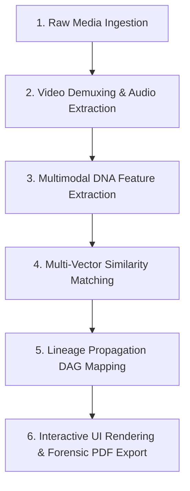

# TraceLens AI — Frontend Application

> **Cyber forensic dashboard & media DNA visualizer interface built with Next.js & Tailwind CSS**

This is the web application interface for **TraceLens AI**. It provides analysts, fact-checkers, and cybersecurity researchers with real-time ingestion monitoring, interactive perceptual hash visualizers, side-by-side DNA differentials, lineage graphs, and fingerprint sandboxes.

---

## 🏗️ System Architecture & Pipeline Overview

TraceLens AI consists of an interactive Next.js 16 frontend communicating with an asynchronous Python FastAPI backend.

### **System Architecture Diagram**

```
 ┌─────────────────────────────────────────────────────────────────────────┐
 │                       FRONTEND CLIENT (Next.js 16)                      │
 │   Dashboard  │  Upload Pipeline  │  DNA Compare  │ Lineage DAG  │ Sandbox   │
 └────────────────────────────────────┬────────────────────────────────────┘
                                      │ REST API / HTTP JSON
 ┌────────────────────────────────────▼────────────────────────────────────┐
 │                        BACKEND SERVER (FastAPI)                         │
 │ ├── Media Preprocessing & Demuxing (OpenCV + FFmpeg)                    │
 │ ├── Multimodal DNA Feature Engine (Cryptographic, pHash, Spectrogram)  │
 │ ├── Deep AI Vision Embeddings (HuggingFace CLIP ViT-B/32)              │
 │ ├── Similarity Engine & Lineage DAG Generator                           │
 │ ├── OSINT Web Scrapers & AI Manipulation Analyzer                       │
 │ └── Persistence (SQLite ORM) & Forensic PDF ReportLab Generator         │
 └─────────────────────────────────────────────────────────────────────────┘
```

### 🔄 End-to-End Media Processing Pipeline



1. **Storage & Demuxing**: Ingested uploads are stored in backend storage while OpenCV extracts video keyframes and FFmpeg demuxes audio tracks to 11kHz WAV streams.
2. **Multimodal DNA Extraction**: Computes MD5/SHA256 digests, multi-algorithmic perceptual hashes (pHash, dHash, aHash), Librosa audio spectrogram chroma profiles, and HuggingFace CLIP 512D vision vectors.
3. **Similarity Matching**: Cross-matches assets via Hamming distance grids, CLIP cosine vectors, and audio chroma correlation to compute weighted confidence scores.
4. **Lineage Mapping**: Synthesizes parent-child relationship DAG graphs, determining primary source origin across variants.
5. **UI & Forensic Reporting**: Streams processing pipeline status to the frontend and generates streamable dark-mode PDF audit documents via ReportLab.

---

## 🛠️ Complete List of Libraries & Frameworks Used

### **Frontend Stack**
- **[Next.js 16.2](https://nextjs.org/)**: React Framework for production (App Router architecture with Server Components & Client Hooks).
- **[React 19.2](https://react.dev/) & [React DOM 19.2](https://react.dev/)**: Core UI library and DOM rendering engine.
- **[TypeScript 5](https://www.typescriptlang.org/)**: Strongly typed programming language building on JavaScript.
- **[Tailwind CSS v4](https://tailwindcss.com/) (`@tailwindcss/postcss`)**: Utility-first CSS framework for custom styling.
- **[Lucide React](https://lucide.react.dev/) (`lucide-react`)**: Open-source icon library for UI icons.
- **[Framer Motion](https://www.framer.com/motion/) (`framer-motion`)**: Production-ready motion and animation library for React.
- **[Recharts](https://recharts.org/) (`recharts`)**: Redefined chart library built with React and D3.
- **[ESLint 9](https://eslint.org/) (`eslint-config-next`)**: Pluggable JavaScript and Next.js linting utility.

### **Backend Stack**
- **[FastAPI](https://fastapi.tiangolo.com/)**: Modern, fast web framework for building APIs with Python 3.12+.
- **[Uvicorn](https://www.uvicorn.org/) (`uvicorn[standard]`)**: ASGI web server implementation for Python.
- **[SQLAlchemy](https://www.sqlalchemy.org/)**: Python SQL toolkit and ORM interacting with SQLite (`tracelens.db`).
- **[Pydantic](https://docs.pydantic.dev/) & `pydantic-settings`**: Data validation schemas and settings management.
- **[PyTorch](https://pytorch.org/) (`torch`)**: Open-source machine learning framework (CPU-optimized build).
- **[Hugging Face Transformers](https://huggingface.co/docs/transformers/) (`transformers`)**: Machine learning models library running OpenAI CLIP semantic vision embeddings.
- **[OpenCV](https://opencv.org/) (`opencv-python-headless`)**: Computer vision library for keyframe extraction and spatial analysis.
- **[Pillow](https://python-pillow.org/) (`Pillow`)**: Image processing library.
- **[ImageHash](https://pypi.org/project/ImageHash/) (`imagehash`)**: Perceptual image hashing library (pHash, dHash, aHash).
- **[Librosa](https://librosa.org/) (`librosa`)**: Python package for music and audio analysis (chroma spectral profiling).
- **[SciPy](https://scipy.org/) (`scipy`)**: Scientific computing ecosystem (spectral peak processing).
- **[ReportLab](https://www.reportlab.com/) (`reportlab`)**: Library for generating forensic PDF documents and reports.
- **[Python-Multipart](https://github.com/Kludex/python-multipart)**: Streaming multipart parser for file uploads.
- **[HTTPX](https://www.python-httpx.org/) (`httpx`)**: Asynchronous HTTP client for external OSINT queries.
- **[Jinja2](https://jinja.palletsprojects.com/) (`jinja2`)**: Modern templating engine for Python.
- **[Python-Dotenv](https://github.com/theskumar/python-dotenv)**: Reads key-value pairs from `.env` files.
- **[FFmpeg](https://ffmpeg.org/)**: Multimedia framework for video frame sampling and audio extraction (CLI tool).

---

## 💡 Frontend Features & Routes

- 📊 **Executive Dashboard (`/`)**: Main console summarizing indexed media assets, active cases, recent ingestion feeds, and quick navigation shortcuts.
- 🚀 **Ingestion Visualizer (`/upload`)**: Real-time multi-step processing board highlighting file upload, hashing, audio parsing, embedding extraction, and automated cross-matching.
- 🧬 **DNA Comparator (`/compare`)**: Interactive side-by-side console highlighting matching and mismatching bit differentials across 64-bit perceptual hash matrices.
- 🎛️ **Fingerprint Sandbox (`/playground`)**: Transformation slider sandbox allowing real-time testing of crop, watermark, scale, and compression impact on media signatures.
- 🌳 **Media Details & Lineage Graph (`/media/[id]`)**: Comprehensive media view featuring keyframe timelines, metadata inspect panels, and SVG propagation graphs tracing asset lineage.
- 📈 **Evaluation Dashboard (`/evaluation`)**: Benchmark evaluation center rendering algorithm precision/recall curves and performance metrics.
- 🎮 **Interactive Demo Mode (`/demo`)**: Sandbox mode for demonstrating platform capability with pre-loaded media variants.

---

## 🛠️ Getting Started

### Prerequisites
- Node.js version `18.0` or higher (tested on `24.14.1`).

### Running Locally

1. Install npm packages:
   ```bash
   npm install
   ```
2. Start the development server:
   ```bash
   npm run dev
   ```
3. Access the application in your browser at `http://localhost:3000`.
